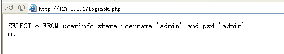

# **软件安全实验报告**

# **WEB开发实践**

​	    	姓名：郭子涵  学号:2312145  班级：信息安全、法学双学位班

------

**目录：**

[TOC]

## 实验要求

复现课本第十章的实验三（10.3.5节）：利用php,编写简单的数据库插入、查询和删除操作的示例。基于课本的完整的例子，进一步了解WEB开发的细节。

## 实验内容

### 安装Deamweaver8


### 安装phpnow

将资源中的压缩包放置在虚拟机中的xp系统下，解压后安装默认的Apache和MySQL版本：


==了解到xp后的操作系统自动提供管理员的机制，要求必须以指定管理员的身份才能安装==，在本地中找到cmd.exe继续安装：


安装成功后，设置密码，跳转到网页127.0.0.1，实际访问的是默认的index.php资源文件（解释性脚本，把php解释语句为对应的指令。


输入密码，测试数据库是否正常，显示OK没问题


点击进入phpMyAdmin,这是一个网页版的数据库管理系统


输入用户名和密码登录


### 创建testDB数据库


创建userinfo表，包含username和pwd两个字段


创建成功：


执行插入操作，插入用户名和密码均为'admin'的一条信息。


### 创建login.html

创建login.html,插入uesername和password两个文本域和提交按钮，为后续向表中插入数据做准备：

```html
<html xmlns="http://www.w3.org/1999/xhtml">
<head>
<meta http-equiv="Content-Type" content="text/html; charset=gb2312" />
<title>无标题文档</title>
</head>

<body>
<form id="form1" name="form1" method="post" action="loginok.php">
  <label>username
  <input name="username" type="text" id="username" />
  </label>
  <p>
    <label>password
    <input name="password" type="password" id="password" />
    </label>
  </p>
  <p>
    <input type="submit" name="Submit" value="提交" />
  </p>
</form>
</body>
</html>
```


网页界面如下所示：


点击提交后触发form的提交事件，交给**loginok.php**脚本处理，这个脚本将获取用户名和密码的内容。==由于请求方式为"get"，在url上可以看到请求的用户名和密码的内容都会在上面显示。==


### 编写login.php文件

定义username和password两个变量，由于上述login.html定义使用get的方式获取，因此此处也用get的方式获取变量，然后打印username的值。

```php
<?php 
$username=$_GET['username']
$password=$_GET['password']
echo $username

?>
```

刷新后可以看到在网站上的打印出来的username


### 连接数据库并完成查询

通过mysql_connect连接数据库，mysql_db_query函数执行数据库SQL语句，mysql_fetch_array函数判断是否查找成功，如果能够成功去到，则返回为真，打印“ok”，否则返回为假。处理完之后，释放数据库。如果占用数据库连接没有释放，之后在此使用此脚本时，可能就没有办法完成连接的建立。


```php
<?php 
$conn=mysql_connect("localhost", "root", "123456");    //连接数据库
$username = $_POST['username'];
$pwd = $_POST['password'];
$SQLStr = "SELECT * FROM userinfo where username='$username' and pwd='$pwd'"; 
echo $SQLStr ;
$result=mysql_db_query("testDB", $SQLStr, $conn); //执行数据库SQL语句
// 获取查询结果
if ($row=mysql_fetch_array($result))//读取数据内容
	echo "<br>OK<br>";
else 
	echo "<br>false<br>";
	// 释放资源
	mysql_free_result($result);
	// 关闭连接
	mysql_close($conn);  
?>
```

输入错误和正确的用户名和密码验证：




### 修改login.php

修改login.php实现当正确输入用户名和密码时，弹出ok窗口，错误输入时，弹出false窗口，并返回sys.php网页。

```php
if ($isOK==1)
{
	?>
	<script language="javascript">
	alert("ok");
	window.location.href="sys.php";
	<?php
}else{
	?>
	<script language="javascript">
	alert("false");
	history.bach();
}
?>
```

执行验证，左图为正确输入结果，右图为错误输入结果：

<center class="half">    
        
     
</center>


### 创建news表

在phpMyAdmin中创建new表


### 创建sys.php

实现一个topic域，content文本区域和提交按钮，为news中实现插入操作布局：

```php
<html xmlns="http://www.w3.org/1999/xhtml">
<head>
<meta http-equiv="Content-Type" content="text/html; charset=gb2312" />
<title>无标题文档</title>
</head>

<body>
<form id="form1" name="form1" method="post" action="addokok.php">
  <label>topic
  <input name="topic" type="text" id="topic" />
  </label>
  <p>
    <label>content<br />
    <textarea name="content" cols="60" rows="8" id="content"></textarea>
    </label>
  </p>
  <p>&nbsp;</p>
</form>
</body>
</html>
```


运行验证：


### 创建addok.php，实现nes表中的插入内容功能

实现向news表中插入内容功能：

```php
<?php 
$conn=mysql_connect("localhost", "root", "123456");    //连接数据库
	mysql_select_db("testDB");   
$topic = $_POST['topic'];
$content = $_POST['content'];
$SQLStr = "insert into news(topic,content) values('$topic','$content') "; 
echo $SQLStr ;
$result=mysql_query($SQLStr);

	// 关闭连接
	mysql_close($conn);  

if ($result)
{
	?>
	<script language="javascript">
	alert("add ok");
	window.location.href="sys.php";
	</script>
	<?php
}else{
	?>
	<script language="javascript">
	alert("add false");
	history.bach();
	</script>
	<?php
}
?>
```

在phpMyAdmin中可以看到表中确实实现了插入的数据：


### 创建news.php，创建表格显示news表中的id和topic字段

创建表格显示news表的两个字段。执行select语句，用my_sql_db_query执行查询，用mysql_fetch_array函数判断是否读取数据内容，用mysql_data_seek定位到第一条记录，通过while循环，没去除一条记录，就输出。==实现php脚本和html代码混合，组成复杂界面的显示==

```php+HTML
<html xmlns="http://www.w3.org/1999/xhtml">
<head>
<meta http-equiv="Content-Type" content="text/html; charset=gb2312" />
<title>无标题文档</title>
</head>

<body>
<table width="600" border="1" align="center">
  <tr>
    <td>id</td>
    <td>topic</td>
  </tr>
  <?php
  $conn=mysql_connect("localhost","root","123456");
  $SQLStr = "select * from news";
  $result=mysql_db_query("testDB", $SQLStr, $conn); 
  if ($row=mysql_fetch_array($result))//通过循环读取数据内容
  {
  	 // 定位到第一条记录
	 mysql_data_seek($result, 0);
	 // 循环取出记录
	 while ($row=mysql_fetch_row($result))
	 {  
  ?>
  <tr>
    <td>1</td>
    <td>1</td>
  </tr>
  <?php
  			}
		}
  ?>
</table>
<p>&nbsp;</p>
</body>
</html>
```

运行，显示结果：

修改代码，实现在第二个字段加上超链接：

```php+HTML
  <tr>
    <td><?php echo $row[0]; ?></td>
    <td><a href="see.php?newid=<?php echo $row[0]; ?>"><?php echo $row[1]; ?>
	</a></td>
  </tr>
```

运行验证结果如下：


### 创建see.php，完善超链接输出内容

see.php在new.php代码的基础上，保留数据库查询的操作,并输出记录的两个字段的内容

```php+html
<!DOCTYPE html PUBLIC "-//W3C//DTD XHTML 1.0 Transitional//EN" "http://www.w3.org/TR/xhtml1/DTD/xhtml1-transitional.dtd">
<html xmlns="http://www.w3.org/1999/xhtml">
<head>
<meta http-equiv="Content-Type" content="text/html; charset=gb2312" />
<title>无标题文档</title>
</head>

<body>
  <?php
  $conn=mysql_connect("localhost","root","123456");
  $id=$_GET['newsid'];
  $SQLStr = "select topic,content from news where newsid='$id'";
  $result=mysql_db_query("testDB", $SQLStr, $conn); 
  if ($row=mysql_fetch_array($result))//通过循环读取数据内容
  {
  	 // 定位到第一条记录
	 mysql_data_seek($result, 0);
	 // 循环取出记录
	 while ($row=mysql_fetch_row($result))
	 {  
	 ?>
	 	topic:<?php $row[0]; ?><br>
		content:<?php echo $row[1]; ?><br>
	<?php
	
		}
	}
  ?>
</body>
</html>
```

刷新验证，最终实现内容正确输出：


### 创建del.php，实现删除功能

mysql_query执行删除操作，然后返回删除成功与否的弹窗

```php
<?php 
$conn=mysql_connect("localhost", "root", "123456");   mysql_select_db("testDB");             
$newsid = $_GET['newsid']; 
$SQLStr = "delete from news where newsid=$newsid";   
echo $SQLStr;
$result=mysql_query($SQLStr);             
// 关闭连接
mysql_close($conn);               
if ($result)
{
	?>
	<script> 
		alert("delete succes");
		window.location.href="sys.php";   
	</script>
	<?php
	}else{
		?>
		<script> 
			alert("delete failed");
			history.back();  
            </script>
            <?php
        }             
?>
```

正确执行删除操作结果如下：


## 心得体会

​	本次实验进行了一个完整的案例，体会了用Dreamveaver开发自己的网站和数据库处理的完整流程。编写html和php脚本时也学习到php和html语言的语法，并与数据库连接，并对其中的表进行插入、增加、查询和删除等操作方面内容。对WEB开发有了初步的认识，总结其开发流程和核心组件如下思维导图所示：


​	同时本次实验在“post”和“get”两中不同的获取信息的差异中，更好地理解了前端与后端交互过程，对前端和后端的开发有了一定的了解，查阅资料了解到HTTP的其他常用请求方式：

**1、GET方法**

- GET方法用于使用给定的URI从给定服务器中检索信息，即从指定资源中请求数据。使用GET方法的请求应该只是检索数据，并且不应对数据产生其他影响。在GET请求的URL中发送查询字符串（名称/值对），需要这样写：
  **/test/demo_form.php?name1=value1&name2=value2**
- GET请求是可以缓存的，我们可以从浏览器历史记录中查找到GET请求，还可以把它收藏到书签中；且GET请求有长度限制，仅用于请求数据（不修改）。==因GET请求的不安全性，在处理敏感数据时，绝不可以使用GET请求。==

**2、POST方法**

​	POST方法用于将数据发送到服务器以创建或更新资源，它要求服务器确认请求中包含的内容作为由URI区分的Web资源的另一个下属。==POST请求永远不会被缓存，且对数据长度没有限制；我们无法从浏览器历史记录中查找到POST请求。==

**3、HEAD方法**

​	与GET方法相同，但没有响应体，仅传输状态行和标题部分。这对于恢复相应头部编写的元数据非常有用，而无需传输整个内容。

**4、PUT方法**

​	PUT方法用于将数据发送到服务器以创建或更新资源，它可以用上传的内容替换目标资源中的所有当前内容。它会将包含的元素放在所提供的URI下，如果URI指示的是当前资源，则会被改变。如果URI未指示当前资源，则服务器可以使用该URI创建资源。

**5、DELETE方法**

​	用来删除指定的资源，它会删除URI给出的目标资源的所有当前内容。

**6、CONNECT方法**

​	用来建立到给定URI标识的服务器的隧道；它通过简单的TCP /IP隧道更改请求连接，通常实使用解码的HTTP代理来进行SSL编码的通信（HTTPS）。

**7、OPTIONS方法**

​	用来描述了目标资源的通信选项，会返回服务器支持预定义URL的HTTP策略。

**8、TRACE方法**

​	用于沿着目标资源的路径执行消息环回测试；它回应收到的请求，以便客户可以看到中间服务器进行了哪些（假设任何）进度或增量。 

​	总体来说，本次实验收获颇丰。  

