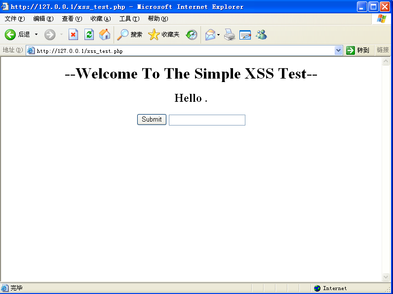
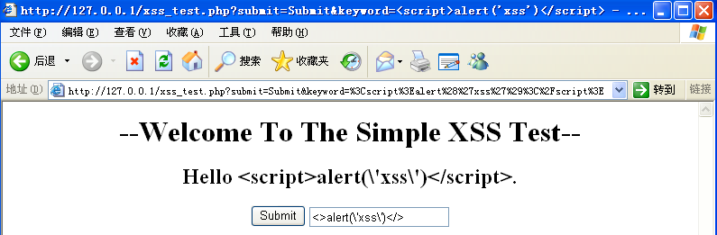
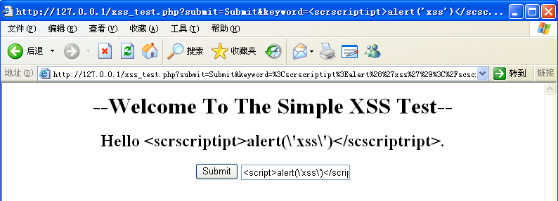
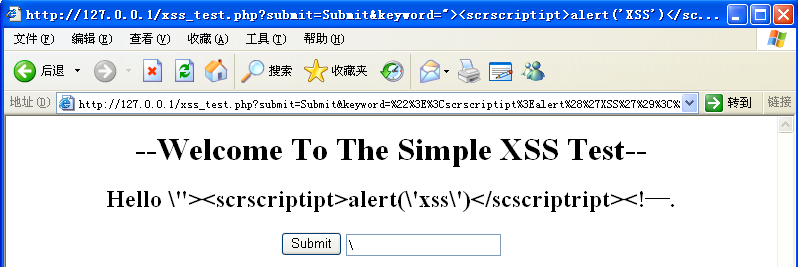
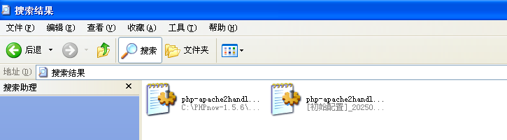
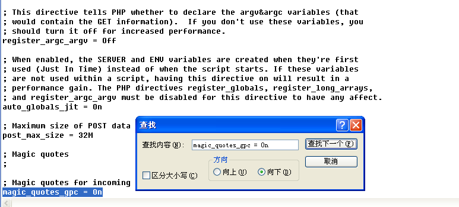
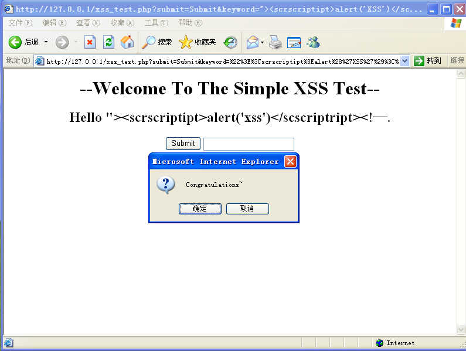
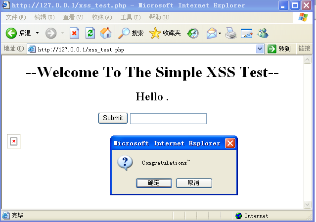

# **软件安全实验报告**

# **跨站脚本攻击**

​		    姓名：郭子涵  学号：2312145  班级：信息安全、法学双学位班

------

## 实验要求

复现课本第十一章实验三，通过img和script两类方法实现跨站脚本攻击，撰写实现报告。

## 实验背景

​	XSS(Cross-Site Scripting,跨站脚本攻击）是一种代码注入攻击。攻击者在目标网站上注入恶意代码，当用户(被攻击者)登录网站时就会执行这些恶意代码，通过这些脚本可以读取cookie,session tokens，或者网站其他敏感的网站信息，对用户进行钓鱼欺诈。

​	XSS攻击的原理是指攻击者在网页中嵌入客户端脚本，通常是JavaScript 编写的恶意代码，也有使用其他客户端脚本语言编写的。当用户使用浏览器浏览被嵌入恶意代码的网页时，恶意代码将会在用户的浏览器上执行。Javascript 可以用来获取用户的 Cookie、改变网页内容、URL 跳转，攻击者可以在 script 标签中输入 Javascript 代码，如 alert(/xss/)，实现一些“特殊效果”。其攻击过程可通过下图形象展示：


​	XSS分为反射型、存储型和DOM型:

1. 反射型也称为非持久型，这种类型的脚本是最常见的，也是使用最为广泛的一种，主要用于将恶意的脚本附加到URL地址的参数中。
2. 存储型：攻击者将已经构造完成的恶意页面发送给用户，用户访问看似正常的页面后收到攻击，这类XSS通常无法直接在URL中看到恶意代码，具有较强的持久性和隐蔽性。

3. DOM型XSS无需和后端交互，而是基于JavaScript上，JS解析URL中恶意参数导致执行JS代码

​	本次实验使用\<scripts>和\标签的两种方式实现简单的XSS攻击。

## 实验内容

### scripts方法

插入源代码：

```php+HTML
<!DOCTYPE html>
<head>
<meta http-equiv="content-type" content="text/html;charset=utf-8">
<script>
window.alert = function()
{
	confirm("Congratulations~");
}
</script>
</head>
<body>
<h1 align=center>--Welcome To The Simple XSS Test--</h1>
<?php
ini_set("display_errors", 0);
$str =strtolower( $_GET["keyword"]);
$str2=str_replace("script","",$str);
$str3=str_replace("on","",$str2);
$str4=str_replace("src","",$str3);
echo "<h2 align=center>Hello ".htmlspecialchars($str).".</h2>".'<center>
<form action=xss_test.php method=GET>
<input type=submit name=submit value=Submit />
<input name=keyword  value="'.$str4.'">
</form>
</center>';
?>
</body>
</html>
```


连接数据库，进入该网页：



使用简单的XSS脚本\<script>alert('xss')\</script>来进行测试。点击Submit按钮以后，效果如下图所示，Hello后面出现了我们输入的内容，并且输入框中的回显过滤了script关键字：



这个时候我们考虑后台只是最简单的一次过滤。于是利用双写关键字绕过，构造脚本：\<scrscriptipt>alert('xss')\</scscriptript>测试。执行效果如下图所示，输入框中的回显确实是我们想要攻击的脚本，但是代码并没有执行。



由于在黑盒测试情况下，我们并不能看到全部代码的整个逻辑，所以无法判断问题到底出在哪里。我们右键查看源码如下：

```php+HTML
<!DOCTYPE html>
<head>
<meta http-equiv="content-type" content="text/html;charset=utf-8">
<script>
window.alert = function()
{
	confirm("Congratulations~");
}
</script>
</head>
<body>
<h1 align=center>--Welcome To The Simple XSS Test--</h1>
<h2 align=center>Hello &quot;&gt;&lt;scrscriptipt&gt;alert('xss')&lt;/scscriptript&gt;&lt;!—.</h2><center>
<form action=xss_test.php method=GET>
<input type=submit name=submit value=Submit />
<input name=keyword  value=""><script>alert('xss')</script><!—">
</form>
</center></body>
</html>
```

​	由**\<input name=keyword  value="\<script>alert('xss')\</script>">**
这行代码可知，我们成功的插入\<script>\</script>标签组,但没有跳出input的标签，使得我们的脚本仅仅可以回显而不能利用。此时我们设计脚本让\<input>标签闭合

​	于是构造如下：**">\<scrscriptipt>alert('XSS')\</scscriptript><!—"**执行是，发现还是没有成功，在界面显示

​	**Hello\\">\<scrscriptipt>alert('XSS')\</scscriptript><!—.**

​	在双引号前多了一个反斜杠，了解到输入的双引号不能正常被处理，是因为php服务器自动会对输入的双引号等进行转义，以预防用户构造特殊输入进行攻击。



​	为了确保实验可以成功运行，请在phpnow安装目录下搜索文件**php-apache2handler.ini**，并将**“magic_quotes_gpc = On”**设置为**“magic_quotes_gpc = Off”**。





再次执行脚本**">\<scrscriptipt>alert('XSS')\</scscriptript><!—"**，成功！



### img方法

使用\标签的脚本构造方法,源码如下：

```php+HTML
<!DOCTYPE html>
<head>
<meta http-equiv="content-type" content="text/html;charset=utf-8">
<script>
window.alert = function()
{
    confirm("Congratulations~");
}
</script>
</head>
<body>
<h1 align=center>--Welcome To The Simple XSS Test--</h1>
<?php
ini_set("display_errors", 0);
$str = strtolower($_GET["keyword"]);
$str2 = str_replace("script", "", $str);
$str3 = str_replace("on", "", $str2);
$str4 = str_replace("src", "", $str3);
echo "<h2 align=center>Hello " . htmlspecialchars($str) . ".</h2><center>
<form action=xss_test.php method=GET>
<input type=submit name=submit value=Submit />
<input name=keyword value='" . htmlspecialchars($str4) . "'>
</form>
</center>";
?>


</body>
</html>
```

​	``是XSS攻击的payload，\ 是图片标签,`src="nonexistent.jpg"`指定了一个**错误的路径**（服务器上并没有这个文件）因此，浏览器尝试加载图片失败，触发onerror，执行JavaScript`onerror="alert('XSS')"`alert被重写为 confrim("Congratulations~")，浏览器显示弹窗，表示代码执行成功。实验成功截图如下：



## 心得体会

​	本次实验使用\<script>和\两种标签，实现简单的XSS攻击，其中\<script> 属于直接注入；\ 属于隐式事件触发。通过本次实验理解了跨站脚本攻击的基本原理、攻击方式、实现条件等。理解了**XSS 本质上是 HTML 注入+JavaScript 执行**。浏览器在解析 HTML 内容时，若遇到可以执行脚本的位置（如 `<script>`、事件属性），就会运行这些代码。

​	XSS 攻击的核心在于：浏览器信任页面中的脚本，无论它是静态代码还是来自用户输入。执行流程大致总结如下：

1. 用户在输入框中提交了某段看似“合法”的代码；
2. 服务端未能充分过滤并对输入进行 HTML 编码，输出到了页面中；

3. 浏览器在解析 HTML 时，将某些标签或属性（如 \）当作脚本执行环境；

4. 最终执行恶意 JavaScript 代码，实现攻击行为（如弹窗、盗取 Cookie、劫持会话等）

​	综上，本次实验收获颇丰，理解了浏览器的一些行为，尝试如何思考攻击面。